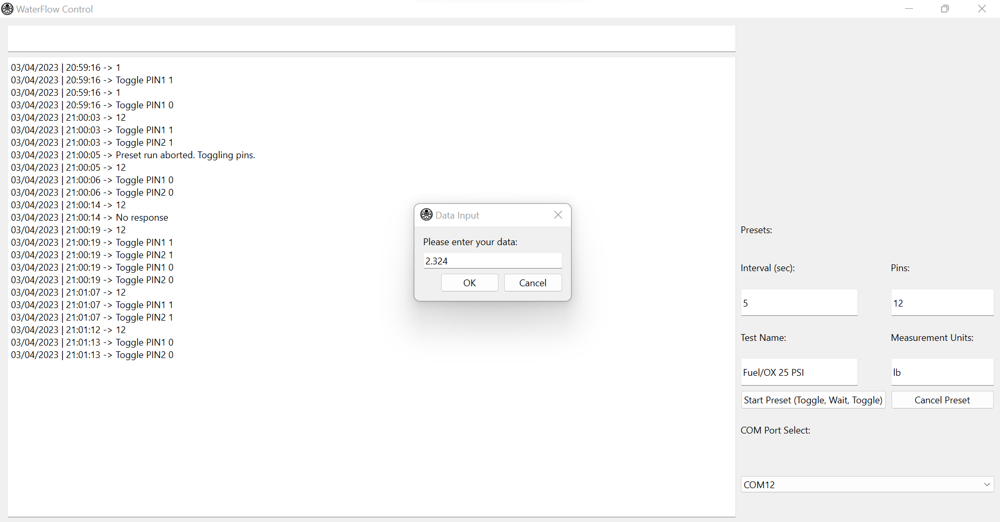

# AV-WaterFlow-GUI
Waterflow GUI with basic serial terminal functions to aid in streamlining testing procedures.

-- NOW DEPRECATED --

## Dependencies and Running
- Make sure you have Python installed. 
- Make sure you have pip, or any package manager you are familiar with.
- Install PyQt6: ex - ```pip install PyQt6```
- Install pandas: ex - ```pip install pandas```
- Install pyserial: ex - ```pip install pyserial```
- To run the program, you may click run in an IDE of your choice
- Or, type ```python3 main.py``` (linux) or ```py main.py``` (windows) from inside the directory where the repository is located.

## Logging
Note: Logging is currently only available when using preset tests. Full system logging may be implemented in the future.
Additionally, make sure your devices (like your Arduino Nano) plugged in prior to starting the program, as live COM port checking has not been implemented yet.

Other than that, future points of work also include: calculations, better csv formatting, etc.

## GUI Layout


Feel free to reach out to me (Nick Fan, nfan17) if you have any questions or need help.
